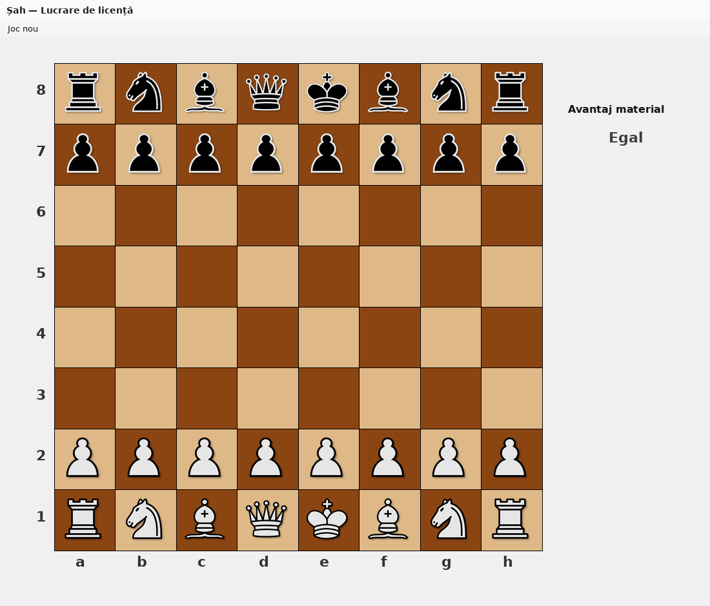
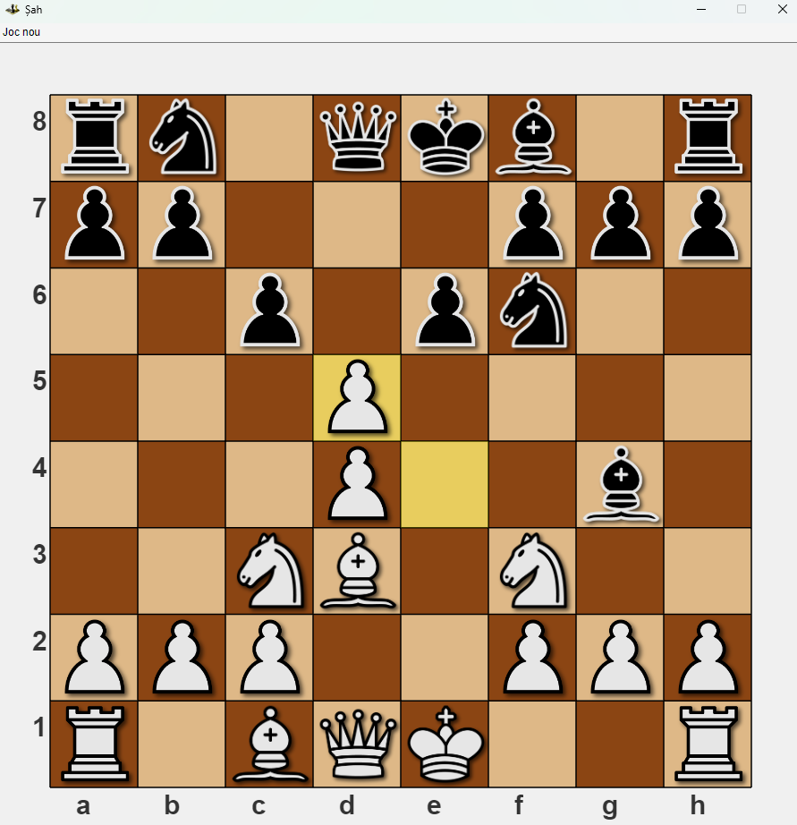
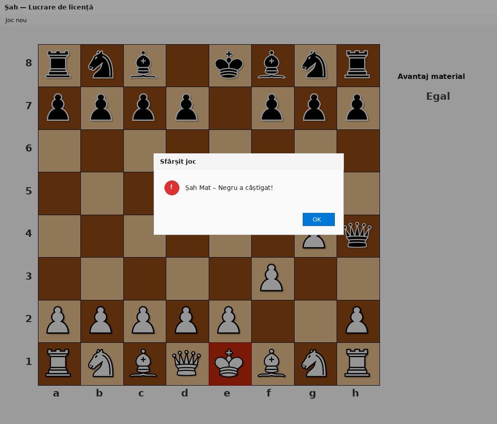

# Chess — Bachelor's Thesis (MATLAB)

A chess game written in MATLAB as a **bachelor's thesis** project: custom
graphical interface (mouse drag & drop), bitboard position representation,
complete move generation (including castling, en passant, and promotion),
and a search engine with minimax, alpha-beta pruning, iterative deepening,
quiescence search, and a transposition table.

## Screenshots





## Features

- **Custom graphical interface**: 8x8 board with `uifigure` / `uiimage`,
  piece PNGs, drag & drop, last-move highlight, and **legal-move hints**
  when a piece is picked up.
- **Two game modes**: User vs User and User vs Robot (search depth 1–5).
- **Complete chess rules**: normal moves for all pieces, **castling**,
  **en passant**, and **pawn promotion** (UI dialog for humans; auto-queen
  for the engine).
- **Check, checkmate, and stalemate** detection with visual feedback.
- **FEN** loading for the starting position / reset (placement, side to
  move, castling rights, en passant square).
- **Status line** while the robot is thinking.

## Search engine

- Minimax with **alpha-beta** pruning
- **Iterative deepening** up to the selected depth
- **Quiescence search** (captures) at leaf nodes
- **MVV-LVA** move ordering + killer moves + TT move first
- **Transposition table** with Zobrist hashing
- Evaluation: **material** (incremental) + **piece-square tables**

## Tech stack

- MATLAB, OOP (`classdef`, `handle` classes)
- Position as **bitboards** (`uint64` per piece type/color) with make/unmake
- Move encoding: `[from, to, piece, captured, special, promo]`
  - `special`: 0 normal, 1 castle KS, 2 castle QS, 3 en passant, 4 promotion

## Running locally

1. Open MATLAB (R2020a or newer recommended).
2. Set the `Sah/` folder as the **Current Folder** (or add it to the path).
3. Start the game:
   ```matlab
   joc = Sah();
   ```
4. User vs User starts by default. For User vs Robot, use the menu:
   **Joc nou → Utilizator vs Robot → Adâncime=N**.
## Perft validation

From the `Sah/` folder:

```matlab
run_perft
```

Expected start-position counts: depth 1 = 20, depth 2 = 400, depth 3 = 8902.
Kiwipete: depth 1 = 48, depth 2 = 2039.

## Technical decisions worth noting

- **Bitboards instead of an 8x8 cell matrix** for fast make/unmake during search.
- **History stack** on the bitboard restores castling rights and the en passant
  square on unmake — required for correct search and perft.
- **Legality by simulation**: apply move, test whether own king is attacked, undo.
- **Evaluation** combines incremental material with middlegame PST; not a
  full positional engine, but much stronger than material-only.
- **Draw rules not implemented**: threefold repetition and the 50-move rule
  are out of scope; stalemate is detected.

## Project structure

```
Sah/
  Sah.m                 -> main window, board drawing, mouse drag & drop
  Joc.m                 -> links rules (Mutari) to the two players
  Bitboard.m            -> bitboards, FEN, make/unmake, eval, Zobrist
  Mutari.m              -> move generation/validation + perft
  Engine.m              -> iterative deepening / alpha-beta / quiescence
  TranspositionTable.m  -> fixed-size TT
  Jucator.m             -> abstract player
  Utilizator.m          -> human player
  Robot.m               -> computer player
  Piesa.m               -> piece widget on the UI
  run_perft.m           -> correctness harness
  img/                  -> PNG piece images
```

## Thesis context

This repository is the software artifact for a bachelor's thesis on chess
programming: bitboard representation, legal move generation, and adversarial
search. MATLAB was the environment required/chosen for the thesis; the
algorithms (bitboards, alpha-beta, TT) are language-independent.
